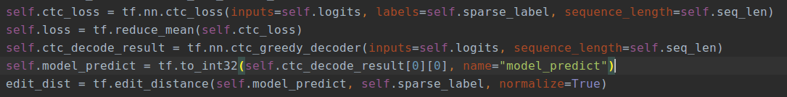
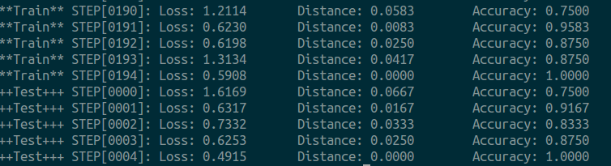

#  CNN LSTM CTC 基于tensorflow框架构建ocr**不定长**验证码识别

### 不定长验证码形态

### 环境　推荐[Anaconda mini管理](https://www.jianshu.com/p/169403f7e40c)

python3.6.5 

tensorflow==1.8.0

### 项目文件
1. prepare_data.py 验证码预处理文件, 将如上验证码保留特定颜色字符. 最终生成验证码文件对应正确字符, 存入utils.py中.
 采用[tf内置Dataset](https://zhuanlan.zhihu.com/p/30751039?group_id=910593989729128448)读取方式
2. image_ocr_model.py 采用CNN特征抽取, LSTM时序+CTC对齐
3. utils.py　为模型训练样本读取
4. train_captcha.py 加载训练模型

### 主要代码/训练效果
1. 主要代码　

2. 训练效果  

### 参考文档
[CTC基本原理解释](https://blog.csdn.net/luodongri/article/details/80100297)

[CTC对齐动态图](https://distill.pub/2017/ctc/)

[CTC论文](http://www.cs.toronto.edu/~graves/icml_2006.pdf)
